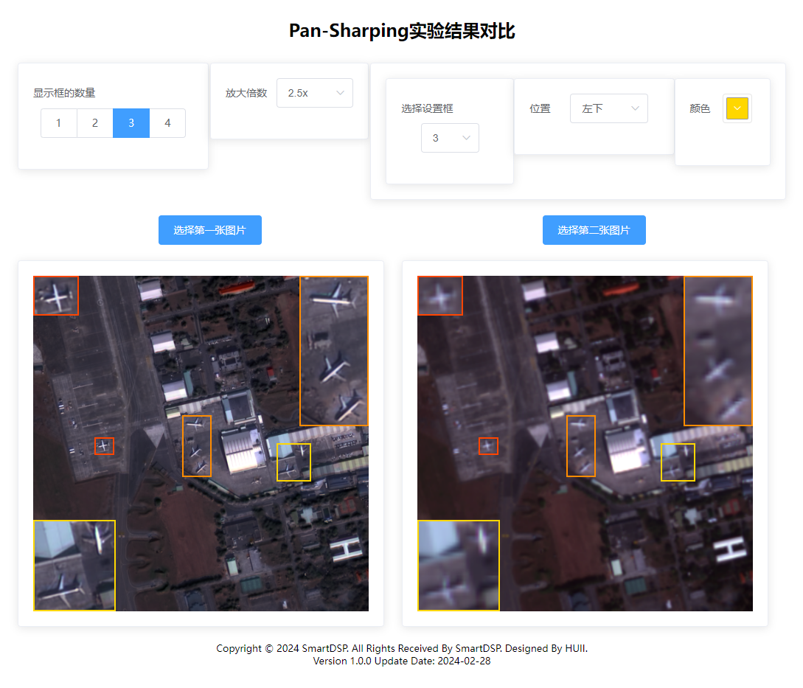

# Image_Local_Magnification_Web

## Introduction
A pure HTML web page can enlarge the picture area and compare the same area of two pictures.

## Usage
Double-click to open index.html to use. Note that since [Element UI](https://element.eleme.cn/#/zh-CN) is used, the browser version used needs to be supported.

## Attention
The device that opens this html needs to be connected to the Internet.